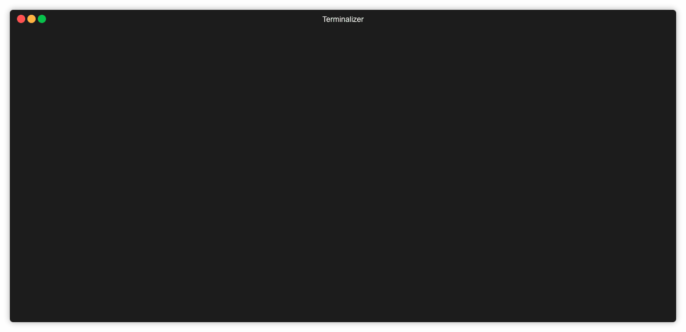

## 😈Devild - Wordpress DB export & replace the easy way

Database export and search replace for sql files

## How to use
- `npm i -g @perlatsp/devild` to install it as a global package. 
- You can now access it by running `devild <command>`
- **NOTE!** If you are using devilbox / docker containers you will need to do the above inside the container.
  
### Available commands
- `devild` or `devild help` - Will display help message with available commands
- `devild db:export`        - Will ask credentials to export database
- `devild db:replace`       - Will ask questions to replace url in the exported `sql` file
- `devild install`          - Will create sample config file to create projects repositories (name,type,url)- 
- `devild project:start`    - Will ask questions to create a new project based upon set configurations
- `devild project:add`      - Will ask questions to add a new project to your configuration file

--- 
### TODO
- [x] Search Replace in current dir
- [x] Create Project (WP or Laravel ) cloning set repos
- [x] Database Export
- [x] Database Replace
- [ ] CRUD config.json file 
- [ ] Database Import
- [ ] SOMETHING ELSE

Disclaimer

    This project was originally intended for personal use and not to publish it therefore I used best Worst Practices and Antipatterns to create this. PR more than welcome.

